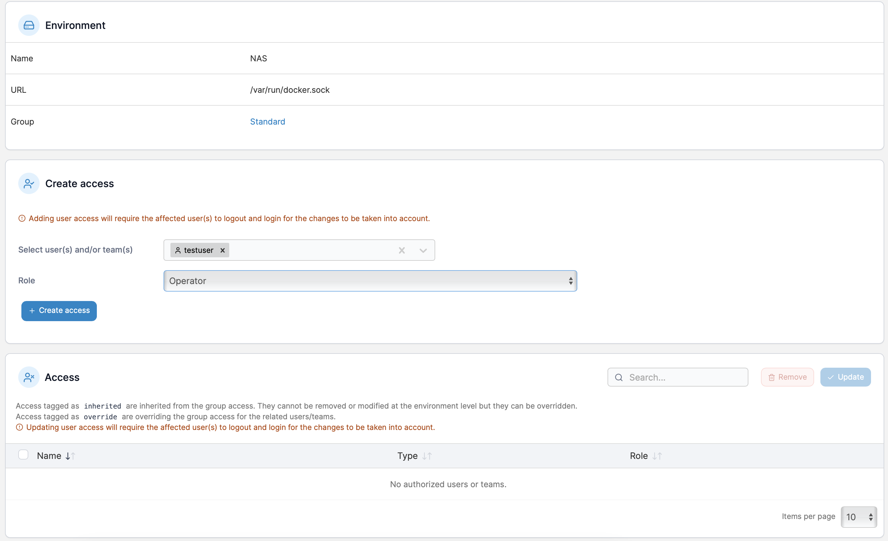

# Fünf wichtige Features von Portainer

- [Fünf wichtige Features von Portainer](#fünf-wichtige-features-von-portainer)
  - [1. Docker Environments](#1-docker-environments)
  - [2. Zugriffskontrolle](#2-zugriffskontrolle)
  - [3. CI/CD Möglichkeiten](#3-cicd-möglichkeiten)
  - [4. Monitoring](#4-monitoring)
  - [5. Kubernetes](#5-kubernetes)

Wie bereits im [ersten Blogpost](https://www.ayedo.de/posts/warum-man-portainer-portainer-ansteller-der-konsole-nutzen-sollte/) erwähnt, ist Portainer ein mächtiges Tool, welches alle Funktionen von Docker grafisch darstellt und vereinfacht. Dabei bietet Portainer über die von Docker bekannten Funktionen hinaus, noch einige weitere Features, welche die Verwaltung von Docker Containern noch einfacher machen.

In diesem Blogpost möchte ich fünf dieser Features vorstellen.

Bei den Features handelt es sich nicht unbedingt um die wichtigsten Features, sondern um die Features, welche ich am interessantesten finde.

## 1. Docker Environments

Portainer bietet die Möglichkeit, mehrere Docker Environments oder auch Kubernetes Environments (aber dazu in Punkt 5 mehr) zu verwalten. 

Dies ist besonders für Entwickler und Systemadministratoren wichtig, die mit verschiedenen Docker-Installationen arbeiten.

Mit Portainer können Benutzer mehrere Docker-Hosts hinzufügen und verwalten, die auf verschiedenen VMs oder Servern laufen. 

Dadurch muss man nicht mehr zwischen den Systemen wechseln und kann bequem über die Portainer GUI zwischen den verschiedenen Docker Hosts wechseln. 
 
Neben einer höheren Flexibilität und einer verbesserten Skalierbarkeit ist meiner Meinung nach vor allem die Möglichkeit, Systeme fachlich zu trennen, ein großer Vorteil.

Hierdurch kann beispielsweise Abteilung A ein Environment besitzen und Abteilung B ein anderes. 

Entwicklern kann somit extrem geholfen werden, sich zurechtzufinden und die Übersicht zu behalten.

## 2. Zugriffskontrolle

Docker bietet von Haus aus keine Möglichkeit, um Nutzer und Gruppen zu verwalten und diesen Rechte zuzuweisen. Portainer nimmt sich dieser Aufgabe an und bietet eine einfache Möglichkeit. 

Dabei können Nutzer und Teams angelegt werden, denen dann Rechte zugewiesen werden können.

In diesem Beispiel wurde ein Team Development angelegt, die Rechte, welches das Team besitzt, werden an einer anderen Stelle Zugwiesen.

Im 2. Schritt wird ein neuer Nutzer angelegt, welcher dem Team Development zugewiesen wird.

Schaut man sich nun die Teamdetails an, kann man sehen, welche User bereits dem Team zugewiesen wurden. Und welche User noch hinzugefügt werden können. Rechts sieht man den eben erstellten `testuser`, welcher dem Team `development` zugewiesen wurde. Links zu sehen ist der `testuser2`, welcher noch nicht dem Team zugewiesen wurde.

Nun haben wir zwar Nutzer und Teams angelegt, aber noch keine Rechte zugewiesen. Dies geschieht im nächsten Schritt.

Dies kann für jedes Environment vorgenommen werden. 
Schauen wir uns das ganze an unserem Beispiel an. 

Über die Environmenteinstellungen können wir nun die Zugriffsrechte verwalten.

Einmal ein Environment ausgewählt, können unter dem Punkt `Create access` sowohl Teams als auch Nutzer ausgewählt werden, um diesen eine Rolle zuzuweisen.

Dabei stehen folgende Rollen zur Verfügung:

| Rolle                     | Beschreibung                                             |
| ------------------------- | -------------------------------------------------------- |
| Environment administrator | Full control of all resources in an environment          |
| Operator	Operational      | control of all existing resources in an environment      |
| Helpdesk                  | Read-only access of all resources in an environment      |
| Standard user             | Full control of assigned resources in an environment     |
| Read-only user            | Read-only access of assigned resources in an environment |

Natürlich können noch mehr feingranularere Rechte vergeben werden, aber für die meisten Anwendungsfälle reichen die bis hierhin gezeigten Einstellungsmöglichkeiten aus, um die Zugriffskontrolle zu verwalten.

## 3. CI/CD Möglichkeiten

Beim anlegen eines Stacks bietet Portainer die Möglichkeit, die Stacks automatisch zu aktualisieren, wenn es beispielsweise eine neuere Version eines Images gibt.

Ist das Image als `latest` getagged, wird das Image automatisch aktualisiert, wenn eine neue Version verfügbar ist.

Neben der automatischen Aktualisierung von Images bietet Portainer auch die Möglichkeit, die Stacks automatisch zu aktualisieren, wenn sich die Konfiguration ändert.

Entweder durch einen Webhook oder durch einen Polling-Intervall kann Portainer überprüfen, ob es aktuellere Versionen gibt. 
Sollte es eine neuere Version geben, wird diese automatisch ausgerollt.

## 4. Monitoring

Neben den bisher genannten Features bietet Portainer auch basic Monitoring Funktionen zum überwachen der Docker Container.

Metriken wie Memory usage, CPU usage, Network usage und I/O usage werden angezeigt.

> Aktuelle bietet Portainer noch keine Möglichkeit, die Metriken zu exportieren oder Checks durchzuführen. Hierfür würde ich eher zu Grafana + Prometheus raten.

Trotzdem ist es eine nette Funktion, um einen schnellen Überblick über die aktuelle Auslastung zu bekommen.

## 5. Kubernetes 

Das letzte und vielleicht wichtigste Feature ist die Möglichkeit, neben Docker, Docker Swarm auch Kubernetes zu verwalten.

Kubernetes ist immer das Erste, an das man denkt, wenn es um Container Orchestrierung geht. Es ist der Big Player in diesem Bereich und wird von vielen Unternehmen eingesetzt. 

Das Problem dabei ist nur, dass Kubernetes nicht gerade einfach zu bedienen ist und auch nicht immer unbedingt benötigt wird.

Der große Vorteil von Portainer an dieser Stelle ist, dass es mit einem wachsen kann. Das heißt, ich kann mit Docker Standalone anfangen, um meine Container zu verwalten, kann dann vielleicht auf Docker Swarm umsteigen, um nun mit Rolling Updates meine Services zu verwalten und wenn ich dann Kubernetes benötige, kann ich auch dieses mit Portainer verwalten. 

Dies ist aus meiner Sicht ein riesen Mehrwert, da ich mich als unternehmen nicht auf eine Technologie festlegen muss, sondern mit Portainer die Möglichkeit habe mitzuwachsen.
