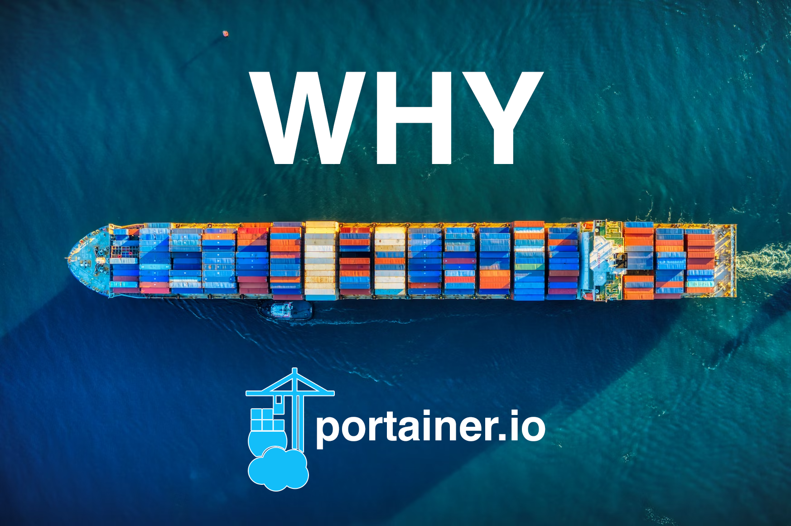
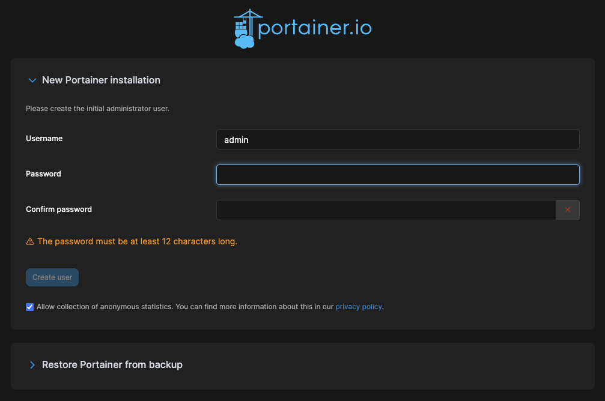
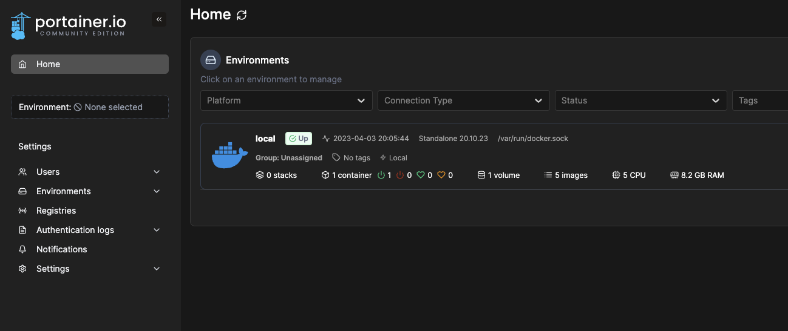
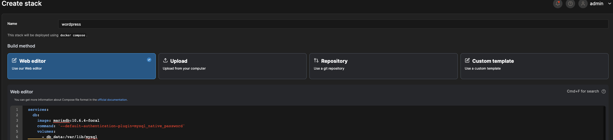

# Warum man Portainer anstelle der Konsole nutzen sollten: Einführung und schneller Einstieg

- [Warum man Portainer anstelle der Konsole nutzen sollten: Einführung und schneller Einstieg](#warum-man-portainer-anstelle-der-konsole-nutzen-sollten-einführung-und-schneller-einstieg)
  - [Warum dieser Eintrag?](#warum-dieser-eintrag)
  - [Was ist Portainer?](#was-ist-portainer)
  - [Praktischer Teil](#praktischer-teil)
    - [Portainer ausrollen](#portainer-ausrollen)
    - [Portainer einrichten](#portainer-einrichten)
    - [Ausrollen einer Anwendung](#ausrollen-einer-anwendung)
  - [Fazit](#fazit)

Für diejenigen die direkt loslegen wollen hier der Link zum [Praktischer Teil](#praktischer-teil)




## Warum dieser Eintrag? 

Immer wieder fällt mir auf, dass sich viele Menschen vor der Kommandozeile scheuen. Das ist auch nicht weiter verwunderlich, denn die Kommandozeile erfordert ein gewisses technisches Verständnis und kann insbesondere für Neulinge und unerfahrene Anwender abschreckend wirken. Immerhin gibt es bei vielen Technologien neben der Kommandozeile auch eine grafische Benutzeroberfläche (GUI), die oft als intuitiver empfunden wird.

Besonders bei komplexeren Befehlen, die über mehrere Zeilen gehen, kann es schwierig werden, den Überblick zu behalten und Fehler zu vermeiden. Aus diesem Grund kann eine grafische Benutzeroberfläche wie Portainer eine große Hilfe sein, um die Verwaltung von Docker-Containern zu vereinfachen und auch weniger erfahrenen Anwendern den Umgang damit zu erleichtern.

Docker bietet zwar eine GUI an (Docker-Desktop) diese richtet sich aber eher an Entwickler und ist nicht für den produktiven Einsatz gedacht. Zumal Docker-Desktop auch nur auf Windows und Mac läuft. 

## Was ist Portainer?

Portainer ist eine Web-GUI für Docker welche selbst in Docker Containern läuft. 
Dabei unterstützt Portainer nicht nur Docker als Platform sondern auch Docker Swarm und Kubernetes.


## Praktischer Teil

### Portainer ausrollen

Die Anleitung kann auf der [Portainer.io](Portainer.io) Seite nachgelesen werden. In diesem Beispiel wird die Community Edition verwendet.

> Vorraussetzung ist ein laufender Docker-Host

In der Konsole müssen Folgende Schritte befolgt werden. Keine Sorge es sind lediglich zwei Befehle die in der Konsole verwendet werden müssen.

Zuerst muss ein Volume angelegt werden.

```bash
docker volume create portainer_data
```

Danach kann Portainer mit einem einzigen Befehl ausgerollt werden.

```bash
docker run -d -p 8000:8000 -p 9443:9443 --name portainer --restart=always -v /var/run/docker.sock:/var/run/docker.sock -v portainer_data:/data portainer/portainer-ce:latest
```

Nach einem kurzen Moment sollte Portainer unter  https://localhost:9443 erreichbar sein.

### Portainer einrichten

Im ersten Schritt muss der Nutzer angelegt werden und ein Passwort vergeben werden.



Danach gelangt man direkt zu Übersicht der verschiedenen Environments. Da wir in diesem Beispiel nur einen Docker Host haben wird nur dieser angezeigt.



Nach einem Klick auf das Environment gelangt man zur Übersicht. 
Von diesem Punkt aus gelangt man ganz einfach zu den verschiedenen Funktionen und Übersichten. 


Prinzipiell wars das so schnell hat man Portainer eingerichtet und kann nun mit der intuitiven GUI arbeiten. 
Über die wichtigsten Features von Portainer werde ich in einem weiteren Blogpost schreiben denn neben den normalen Funktionen welche benötigt werden um Docker zu verwalten bietet Portainer noch einige weitere Features.

### Ausrollen einer Anwendung

Was wäre eine kurze Einführung ohne ein Beispiel?

In diesem Beispiel wird eine Wordpress Instanz mittels einer Docker Compose Datei ausgerollt.
Diese besteht aus einer Datenbank und einem Wordpress Container.

Hierfür klicken wir im Portainer Dashboard auf `Stacks` und danach auf `Add Stack`.



Nun gibt es mehrer möglichkeiten einen Stack auszurollen. 
Die einfachste Möglichkeit ist den integrierten Web Editor zu verwenden. Hierfür klicken wir auf `Web Editor`.

Nun kann ein name für den Stack vergeben werden und der Inhalt der Docker Compose Datei eingefügt werden.

```yaml
services:
  db:
    image: mariadb:10.6.4-focal
    command: '--default-authentication-plugin=mysql_native_password'
    volumes:
      - db_data:/var/lib/mysql
    restart: always
    environment:
      - MYSQL_ROOT_PASSWORD=somewordpress
      - MYSQL_DATABASE=wordpress
      - MYSQL_USER=wordpress
      - MYSQL_PASSWORD=wordpress
    expose:
      - 3306
      - 33060
  wordpress:
    image: wordpress:latest
    volumes:
      - wp_data:/var/www/html
    ports:
      - 80:80
    restart: always
    environment:
      - WORDPRESS_DB_HOST=db
      - WORDPRESS_DB_USER=wordpress
      - WORDPRESS_DB_PASSWORD=wordpress
      - WORDPRESS_DB_NAME=wordpress
volumes:
  db_data:
  wp_data:
```

Danach kann der Stack mit einem Klick auf `Deploy the stack` ausgerollt werden.

Unsere Wordpress Instanz sollte nun in wenigen Sekunden unter [localhost:80](http://localhost/wp-admin/install.php) erreichbar sein. 


## Fazit

Portainer ist ein mächtiges Tool welches alle Funktionen von Docker grafisch darstellt und vereinfacht. Dabei wurde die GUI ganz nach dem KISS Prinzip entwickelt und ist sehr einfach zu bedienen.

Dabei minimiert Portainer den Raum für Fehler und sorgt dafür das es kinderleicht wird eine Anwendung auszurollen und zu verwalten.

In einem weiteren Blogpost werde ich die Fünf wichtigsten Features Beispielhaft vorstellen und zeigen weshalb Portainer viel mehr ist als nur eine GUI. 

Quellen:

* [Portainer.io](https://www.portainer.io/)
* [Container Bild](https://unsplash.com/de/fotos/1cqIcrWFQBI)
* [Wordpress Compose](https://github.com/docker/awesome-compose/blob/master/official-documentation-samples/wordpress/README.md)
