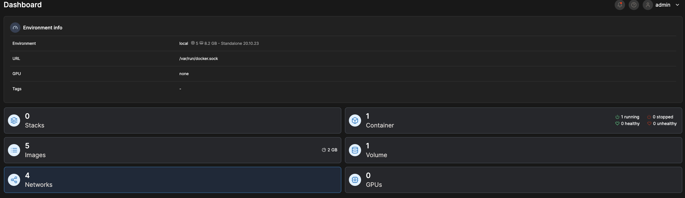

# Warum man Portainer anstelle der Konsole nutzen sollten: Einführung und schneller Einstieg


## Warum dieser Eintrag? 

Ich bemerke es immer wieder. Viele Leute haben Angst vor der Kommandozeile. Das ist auch nicht verwunderlich, denn die Kommandozeile ist nicht gerade einfach zu bedienen besonders für neulinge und Menschen die nicht oft mit ihr in berührung kommen. Vor allem da es zu vielen Technologien neben einer Kommandozeile auch noch eine GUI gibt. Gerade dann wenn befehle komplexer werden und teils über mehrere Zeilen gehen kann schwierig werden dort den überblick zu behalten.

Docker bietet zwar eine GUI an (Docker-Desktop) diese richtet sich aber eher an Entwickler und ist nicht für den produktiven Einsatz gedacht. Zumal Docker-Desktop auch nur auf Windows und Mac läuft. 

## Was ist Portainer?

Portainer ist eine Web-GUI für Docker welche selbst in Docker Containern läuft. 
Dabei unterstützt Portainer nicht nur Docker als Platform sondern auch Docker Swarm und Kubernetes.


## Praktischer Teil

### Portainer ausrollen

Die Anleitung kann auf der [Portainer.io](Portainer.io) Seite nachgelesen werden. In diesem Beispiel wird die Community Edition verwendet.

> Vorraussetzung ist ein laufender Docker-Host

In der Konsole müssen Folgende Schritte befolgt werden. Keine Sorge es sind lediglich zwei Befehle die in der Konsole verwendet werden müssen.

Zuerst muss ein Volume angelegt werden.

```bash
docker volume create portainer_data
```

Danach kann Portainer mit einem einzigen Befehl ausgerollt werden.

```bash
docker run -d -p 8000:8000 -p 9443:9443 --name portainer --restart=always -v /var/run/docker.sock:/var/run/docker.sock -v portainer_data:/data portainer/portainer-ce:latest
```

Nach einem kurzen Moment sollte Portainer unter  https://localhost:9443 erreichbar sein.

### Portainer einrichten





Das wars so schnell hat man Portainer eingerichtet und kann nun mit der GUI arbeiten. 