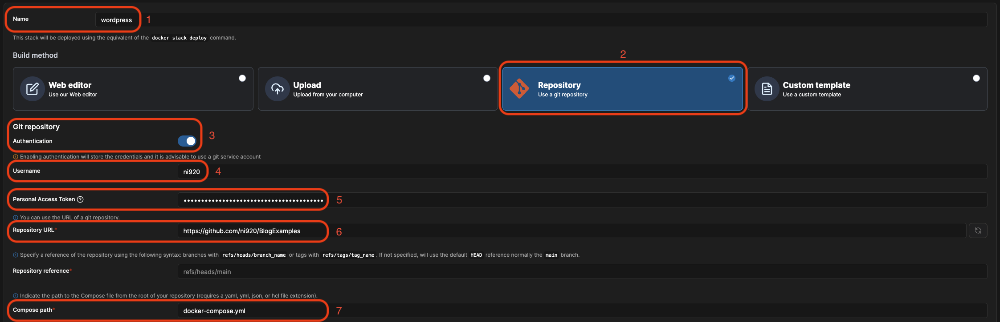
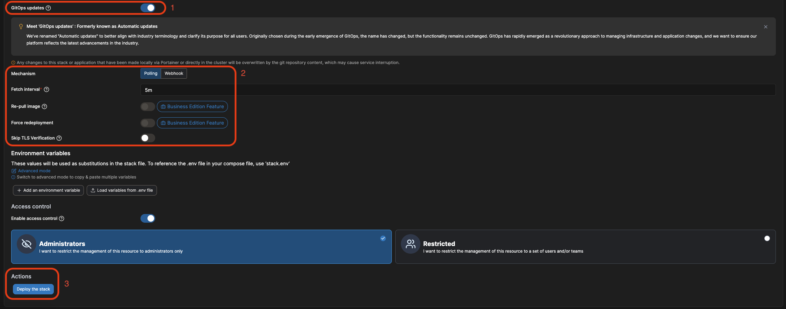

# Zero-downtime deployments mit Docker Swarm und Portainer Teil 2/2

- [Zero-downtime deployments mit Docker Swarm und Portainer Teil 2/2](#zero-downtime-deployments-mit-docker-swarm-und-portainer-teil-22)
- [Was haben wir bisher erreicht?](#was-haben-wir-bisher-erreicht)
- [Vorraussetzungen](#vorraussetzungen)
- [Portainer Stack mit GitHub verknüpfen](#portainer-stack-mit-github-verknüpfen)


# Was haben wir bisher erreicht?

In Teil 1 haben wir uns angeschaut, was nochmal die Unterschiede zwischen Rolling Updates und Zero-downtime deployments sind. Anschließend haben wir unseren Stack vorbereitet, sodas wir ein Zero-downtime deployment durchführen können.

In diesem Teil werden wir uns nun anschauen, wie wir unsere Anwendung über Portainer aktualisieren können. Dabei werden wir über GitHub automatisch ein Update anstoßen lassen, sodass wir in Portainer nichts mehr machen müssen.

# Vorraussetzungen

Ich setze an dieser Stelle voraus das eine laufende Portainer Instanz existiert und das Projekt aus Teil 1 entweder auf GitHub (wird in diesem Beispiel genutzt) oder einem anderen Versionierungssystem liegt.

Wenn es sich bei dem Projekt um ein privates Repository handelt, müssen wir noch einen GitHub Personal Access Token erstellen. Wie das geht wird weiter unten beschrieben:
<details>
<summary>GitHub Personal Access Token erstellen</summary>

Da unser Projekt in einem privaten Repository liegt müssen wir einen Personal Access Token erstellen. Diesen können wir dann in Portainer hinterlegen sodass Portainer auf unser Repository zugreifen kann.

Auf Github geht das ziemlich einfach und wir müssen nur folgende Schritte durchführen:

1. Auf GitHub einloggen
2. Hiernach navigieren wir zu "Settings" und klicken auf "Developer Settings"
3. Hier klicken wir auf "Personal access tokens" und dann auf "Generate new token"
4. Wir geben einen Namen für den Token ein und wählen die Berechtigung "repo" aus
5. Nachdem wir den Token erstellt haben, kopieren wir diesen und speichern ihn an einem sicheren Ort ab.

Das ganze kann auch nochmal in der [GitHub Dokumentation](https://docs.github.com/de/enterprise-cloud@latest/authentication/keeping-your-account-and-data-secure/managing-your-personal-access-tokens) nachgelesen werden.

</details>
<br>


# Portainer Stack mit GitHub verknüpfen

Nun legen wir einen neuen Stack in Portainer an und verknüpfen diesen mit unserem GitHub Repository. Dabei stellen wir ein das Portainer automatisch ein Update anstößt sobald wir eine neue Version auf GitHub pushen.

Zunächst legen wir in Portainer einen neuen Stack an:



1. Wir geben einen Namen für den Stack ein
2. Wir wählen aus, das unser Projekt in einem Git-Repository liegt
3. Da unser Projekt in einem privaten Repository liegt, aktivieren wir die ```Authentication```, damit Portainer auf unser Repository zugreifen kann
4. Hier geben wir unseren GitHub-Benutzernamen ein
5. Nun kommt der zuvor bereits erstellte GitHub Personal Access Token zum Einsatz diesen fügen wir hier ein. Portainer bietet inzwischen auch die Möglichkeit, diese Token zu speichern, sodass diese nur noch ausgewählt werden müssen.
6. Anschließend geben wir die Repository-URL ein
7. Falls die Yaml Datei nicht im Root-Verzeichnis liegt, können wir hier den Pfad angeben.

An dieser Stelle haben wir unser Projekt auf Github mit Portainer verknüpft. Nun müssen wir noch einstellen, dass Portainer automatisch ein Update anstößt, sobald wir eine neue Version auf GitHub pushen.



1. Wir aktivieren die Option ```GitOps updates```
2. Hier haben wir nun mehrere möglichkeiten wie Portainer sich die Updates holen kann. Standardmäßig wird ```Polling``` verwendet. Das bedeutet, dass Portainer in regelmäßigen Abständen nach Updates schaut. Wir können aber auch ```Webhooks``` verwenden. Hierbei wird Portainer von GitHub benachrichtigt, sobald ein Update verfügbar ist. Dazu müssen wir in GitHub noch einen Webhook erstellen. Das würde an dieser Stelle aber zu weit führen. Deswegen verwenden wir hier ```Polling```.
   
   Wir können auch sehen das ```Re-pull image``` und ```Force redeployment``` Premium Features sind, die nur in der Businessversion von Portainer verfügbar sind. 

   ```Re-pull image``` bedeutet das Portainer, das Image neu herunterlädt, sobald ein Update verfügbar ist. 

   ```Force redeployment``` bedeutet das Portainer die Anwendung neu startet, sobald ein Update verfügbar ist.
3. Nun muss nur noch auf Button ```Deploy the stack``` geklickt werden und Portainer wird das Projekt aus dem Repository ausrollen.

Ich empfehle euch, dass ihr euch einmal die [Dokumentation](https://docs.portainer.io/user/edge/stacks/add#gitops-updates) on Portainer dazu anschaut. 
Ab diesem Punkt können wir Änderungen an unserem Stack auf GitHub vornehmen und Portainer wird diese automatisch ausrollen. Dabei wird die Anwendung nicht offline gehen und wir haben ein Zero-downtime deployment erreicht.

An dieser Stelle zeige ich nicht explizit wie der Update-Prozess über GitHub und Portainer aussieht, da dies den Rahmen sprengen würde. Ich empfehle euch das ihr euch das Ganze einfach mal anschaut. Es ist wirklich sehr einfach und intuitiv.


Falls ihr Interesse an der Business Version von Portainer habt könnt ihr euch gerne bei uns melden. Wir beraten euch gerne und zeigen euch die Vorteile der Business Version. 
https://www.ayedo.de/products/portainer-licenses/ 